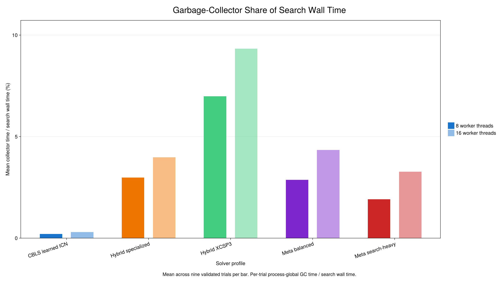

# Li-Lim resource profile: GC and PerfChecker

This post-run analysis compares the fully validated 60-second, 8-thread and 16-thread SINTEF pilot cohorts for lc101, lr101 and lrc101 (three seeds per instance). The width comparison uses eight P-cores versus all 12 physical cores plus four SMT siblings. Each GC observation comes from a sealed trial file; the original campaign reports revalidated every route and trajectory point against Li-Lim.

[Exact PNG](lilim-gc-share-8-vs-16.png) · [Exact PDF](lilim-gc-share-8-vs-16.pdf) · [XKCD PNG](lilim-gc-share-8-vs-16-xkcd.png) · [XKCD PDF](lilim-gc-share-8-vs-16-xkcd.pdf)

## GC summary

| Profile | Threads | Runs | Mean GC seconds | Median GC seconds | Mean GC share of wall time | Mean active CPUs |
|---|---:|---:|---:|---:|---:|---:|
| CBLS learned ICN | 8 | 9 | 0.123 | 0.124 | 0.21% | 7.98 |
| CBLS learned ICN | 16 | 9 | 0.176 | 0.170 | 0.29% | 15.91 |
| Hybrid specialized | 8 | 9 | 1.788 | 2.020 | 2.98% | 7.78 |
| Hybrid specialized | 16 | 9 | 2.387 | 2.627 | 3.98% | 15.34 |
| Hybrid XCSP3 | 8 | 9 | 4.186 | 3.721 | 6.98% | 7.56 |
| Hybrid XCSP3 | 16 | 9 | 5.596 | 4.930 | 9.33% | 14.68 |
| Meta balanced | 8 | 9 | 1.721 | 1.590 | 2.87% | 6.90 |
| Meta balanced | 16 | 9 | 2.600 | 2.363 | 4.33% | 13.53 |
| Meta search-heavy | 8 | 9 | 1.144 | 1.018 | 1.91% | 7.45 |
| Meta search-heavy | 16 | 9 | 1.960 | 1.689 | 3.27% | 15.07 |

The metric is per-trial process-global `Base.gc_num().total_time` inside the shared search interval divided by that trial's wall time. Forced precollection and final validation are excluded; collection across Julia worker threads is included. These captures show collector time, not allocation volume, and the three-seed cohort is too small to establish statistical superiority.

## PerfChecker stack samples

PerfChecker `1.0.0-rc1` used the frozen `LiLim/perfcheck` environment and prepared MetaStrategist plans before the measured calls. Its profile rows are sampling snapshots, not CPU utilization. Counts can grow with thread width and must not be read as absolute work. The following profiles cover learned-ICN CBLS, balanced MetaStrategist and search-heavy MetaStrategist.

### CBLS learned ICN — 8 threads

- `profile`: 1241 samples across 235 sampled source rows.
  Leading sampled sites: ~/.julia/dev/LocalSearchSolvers/src/utils.jl:74 (777); ~/.julia/dev/MetaStrategist/src/specialization.jl:243 (156); ~/.julia/dev/CompositionalNetworks/src/layers/transformation.jl:13 (42); ~/.julia/dev/CompositionalNetworks/src/inplace.jl:572 (35); ~/.julia/dev/CompositionalNetworks/src/inplace.jl:575 (31); ~/.julia/dev/CompositionalNetworks/src/inplace.jl:576 (22); ~/.julia/dev/CompositionalNetworks/src/inplace.jl:533 (19); ~/.julia/dev/CompositionalNetworks/src/layers/transformation.jl:15 (16).
- `wall_profile`: 274 samples across 108 sampled source rows.
  Leading sampled sites: ~/.julia/dev/LocalSearchSolvers/src/utils.jl:74 (174); ~/.julia/dev/MetaStrategist/src/specialization.jl:243 (26); ~/.julia/dev/CompositionalNetworks/src/layers/transformation.jl:13 (14); ~/.julia/dev/CompositionalNetworks/src/inplace.jl:575 (9); ~/.julia/dev/CompositionalNetworks/src/layers/transformation.jl:15 (6); ~/.julia/dev/CompositionalNetworks/src/inplace.jl:572 (6); ~/.julia/dev/CompositionalNetworks/src/inplace.jl:576 (6); ~/.julia/dev/CompositionalNetworks/src/inplace.jl:533 (5).
### Meta balanced — 8 threads

- `profile`: 2508 samples across 435 sampled source rows.
  Leading sampled sites: ~/.julia/dev/MetaStrategist/src/specialization.jl:243 (767); ~/.julia/dev/LocalSearchSolvers/src/utils.jl:74 (473); ~/.julia/packages/MathOptInterface/lY2WB/src/Bridges/bridge_optimizer.jl:1998 (347); ~/.julia/packages/HiGHS/FDUra/src/gen/libhighs.jl:344 (102); ~/.julia/packages/MathOptInterface/lY2WB/src/Bridges/lazy_bridge_optimizer.jl:175 (66); ~/.julia/packages/MathOptInterface/lY2WB/src/Bridges/lazy_bridge_optimizer.jl:161 (57); ~/.julia/dev/LocalSearchSolvers/src/solver.jl:220 (40); ~/.julia/dev/XCSP3Bridges/src/serialization.jl:6 (37).
- `wall_profile`: 292 samples across 119 sampled source rows.
  Leading sampled sites: ~/.julia/dev/LocalSearchSolvers/src/utils.jl:74 (91); ~/.julia/packages/HiGHS/FDUra/src/gen/libhighs.jl:344 (55); ~/.julia/dev/MetaStrategist/src/specialization.jl:243 (28); ~/.julia/packages/HiGHS/FDUra/src/MOI_wrapper.jl:3498 (22); ~/.julia/packages/MathOptInterface/lY2WB/src/Bridges/bridge_optimizer.jl:1998 (15); ~/.julia/packages/JuMP/fQTIY/src/optimizer_interface.jl:1267 (8); ~/.julia/packages/HiGHS/FDUra/src/gen/libhighs.jl:1538 (7); ~/.julia/dev/CompositionalNetworks/src/inplace.jl:575 (5).
### Meta search-heavy — 8 threads

- `profile`: 2678 samples across 443 sampled source rows.
  Leading sampled sites: ~/.julia/dev/MetaStrategist/src/specialization.jl:243 (1075); ~/.julia/dev/LocalSearchSolvers/src/utils.jl:74 (635); ~/.julia/packages/MathOptInterface/lY2WB/src/Bridges/bridge_optimizer.jl:1998 (231); ~/.julia/dev/LocalSearchSolvers/src/solver.jl:220 (97); ~/.julia/packages/HiGHS/FDUra/src/gen/libhighs.jl:344 (53); ~/.julia/packages/JuMP/fQTIY/src/optimizer_interface.jl:1267 (35); ~/.julia/packages/MathOptInterface/lY2WB/src/Bridges/lazy_bridge_optimizer.jl:175 (34); ~/.julia/dev/CompositionalNetworks/src/layers/transformation.jl:13 (31).
- `wall_profile`: 284 samples across 124 sampled source rows.
  Leading sampled sites: ~/.julia/dev/LocalSearchSolvers/src/utils.jl:74 (123); ~/.julia/dev/MetaStrategist/src/specialization.jl:243 (43); ~/.julia/packages/HiGHS/FDUra/src/gen/libhighs.jl:344 (20); ~/.julia/packages/HiGHS/FDUra/src/MOI_wrapper.jl:3498 (13); ~/.julia/packages/MathOptInterface/lY2WB/src/Bridges/bridge_optimizer.jl:1998 (11); ~/.julia/packages/MathOptInterface/lY2WB/src/Bridges/lazy_bridge_optimizer.jl:473 (6); ~/.julia/dev/CompositionalNetworks/src/layers/transformation.jl:13 (6); ~/.julia/dev/LocalSearchSolvers/src/strategies/move.jl:143 (5).
### CBLS learned ICN — 16 threads

- `profile`: 3104 samples across 390 sampled source rows.
  Leading sampled sites: ~/.julia/dev/LocalSearchSolvers/src/utils.jl:74 (2047); ~/.julia/dev/MetaStrategist/src/specialization.jl:243 (204); ~/.julia/dev/CompositionalNetworks/src/layers/transformation.jl:13 (100); ~/.julia/dev/CompositionalNetworks/src/inplace.jl:572 (86); ~/.julia/dev/CompositionalNetworks/src/inplace.jl:576 (84); ~/.julia/dev/CompositionalNetworks/src/inplace.jl:533 (75); ~/.julia/dev/LocalSearchSolvers/src/model.jl:522 (65); ~/.julia/dev/CompositionalNetworks/src/inplace.jl:575 (61).
- `wall_profile`: 318 samples across 136 sampled source rows.
  Leading sampled sites: ~/.julia/dev/LocalSearchSolvers/src/utils.jl:74 (221); ~/.julia/dev/MetaStrategist/src/specialization.jl:243 (22); ~/.julia/dev/CompositionalNetworks/src/layers/transformation.jl:13 (9); ~/.julia/dev/CompositionalNetworks/src/inplace.jl:575 (8); ~/.julia/dev/CompositionalNetworks/src/inplace.jl:572 (7); ~/.julia/dev/CompositionalNetworks/src/inplace.jl:533 (6); ~/.julia/dev/CompositionalNetworks/src/inplace.jl:576 (6); ~/.julia/dev/LocalSearchSolvers/src/model.jl:522 (5).
### Meta balanced — 16 threads

- `profile`: 3960 samples across 582 sampled source rows.
  Leading sampled sites: ~/.julia/dev/LocalSearchSolvers/src/utils.jl:74 (798); ~/.julia/packages/MathOptInterface/lY2WB/src/Bridges/bridge_optimizer.jl:1998 (571); ~/.julia/packages/HiGHS/FDUra/src/gen/libhighs.jl:344 (503); ~/.julia/dev/MetaStrategist/src/specialization.jl:243 (406); ~/.julia/packages/HiGHS/FDUra/src/MOI_wrapper.jl:3498 (256); ~/.julia/packages/MathOptInterface/lY2WB/src/Utilities/DoubleDicts.jl:101 (100); ~/.julia/packages/MathOptInterface/lY2WB/src/Bridges/lazy_bridge_optimizer.jl:175 (86); ~/.julia/packages/HiGHS/FDUra/src/gen/libhighs.jl:1538 (77).
- `wall_profile`: 278 samples across 127 sampled source rows.
  Leading sampled sites: ~/.julia/dev/LocalSearchSolvers/src/utils.jl:74 (71); ~/.julia/packages/HiGHS/FDUra/src/gen/libhighs.jl:344 (45); ~/.julia/dev/MetaStrategist/src/specialization.jl:243 (30); ~/.julia/packages/MathOptInterface/lY2WB/src/Bridges/bridge_optimizer.jl:1998 (30); ~/.julia/dev/XCSP3Bridges/src/serialization.jl:6 (9); ~/.julia/dev/CompositionalNetworks/src/inplace.jl:576 (6); ~/.julia/dev/CompositionalNetworks/src/layers/transformation.jl:13 (5); ~/.julia/packages/MathOptInterface/lY2WB/src/Bridges/lazy_bridge_optimizer.jl:161 (5).
### Meta search-heavy — 16 threads

- `profile`: 4031 samples across 616 sampled source rows.
  Leading sampled sites: ~/.julia/dev/LocalSearchSolvers/src/utils.jl:74 (1334); ~/.julia/dev/MetaStrategist/src/specialization.jl:243 (484); ~/.julia/packages/MathOptInterface/lY2WB/src/Bridges/bridge_optimizer.jl:1998 (448); ~/.julia/packages/HiGHS/FDUra/src/gen/libhighs.jl:344 (221); ~/.julia/packages/JuMP/fQTIY/src/optimizer_interface.jl:1267 (91); ~/.julia/packages/MathOptInterface/lY2WB/src/Bridges/lazy_bridge_optimizer.jl:161 (86); ~/.julia/packages/MathOptInterface/lY2WB/src/Bridges/lazy_bridge_optimizer.jl:175 (81); ~/.julia/packages/HiGHS/FDUra/src/MOI_wrapper.jl:3498 (80).
- `wall_profile`: 335 samples across 146 sampled source rows.
  Leading sampled sites: ~/.julia/dev/LocalSearchSolvers/src/utils.jl:74 (144); ~/.julia/packages/MathOptInterface/lY2WB/src/Bridges/bridge_optimizer.jl:1998 (27); ~/.julia/packages/HiGHS/FDUra/src/gen/libhighs.jl:344 (25); ~/.julia/dev/MetaStrategist/src/specialization.jl:243 (25); ~/.julia/packages/HiGHS/FDUra/src/MOI_wrapper.jl:3498 (9); ~/.julia/packages/JuMP/fQTIY/src/optimizer_interface.jl:1267 (7); ~/.julia/dev/CompositionalNetworks/src/inplace.jl:533 (6); ~/.julia/packages/MathOptInterface/lY2WB/src/Bridges/lazy_bridge_optimizer.jl:473 (5).

PerfChecker emitted non-fatal DWARF address-range warnings but completed and saved both collectors in all six selected runs. Allocation-site profiling is omitted because PerfChecker did not find target source sites in the earlier attempt; no allocation-byte conclusion is made here. The standalone first 8-thread ICN capture without an explicitly prepared MetaStrategist plan is retained only as an uncommitted diagnostic and is excluded from this comparison.

## Files

The source TOML files are the paired campaign trials in the two campaign directories and the six `perfchecker-*-20261005.toml` captures in `LiLim/results/`. `summary.toml` records campaign fingerprints, thread widths, aggregate GC measurements and PerfChecker source-site summaries.
