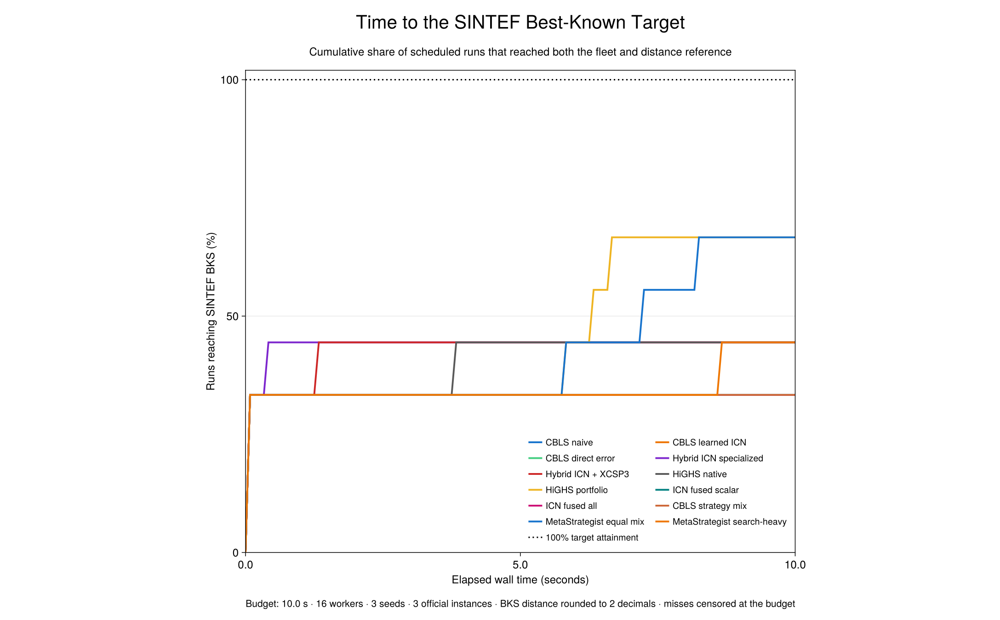
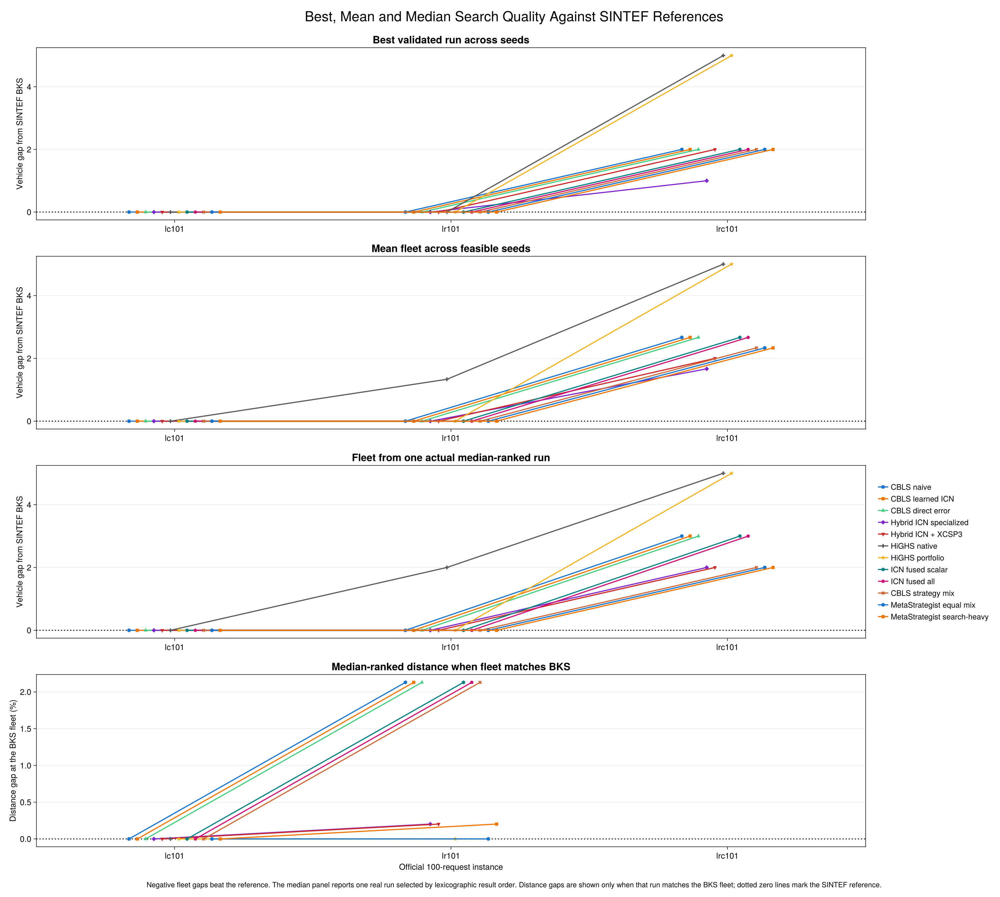
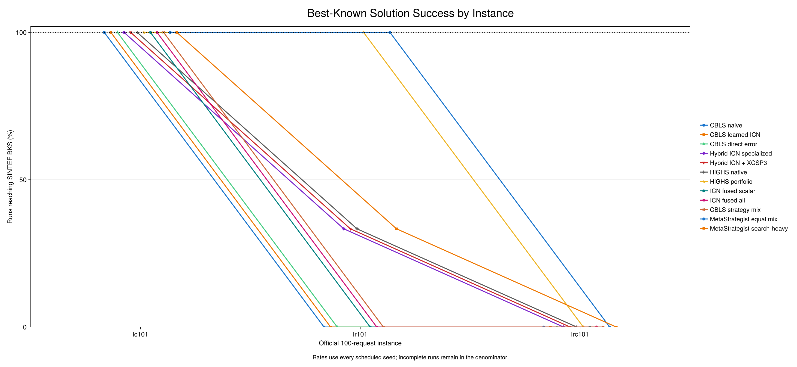
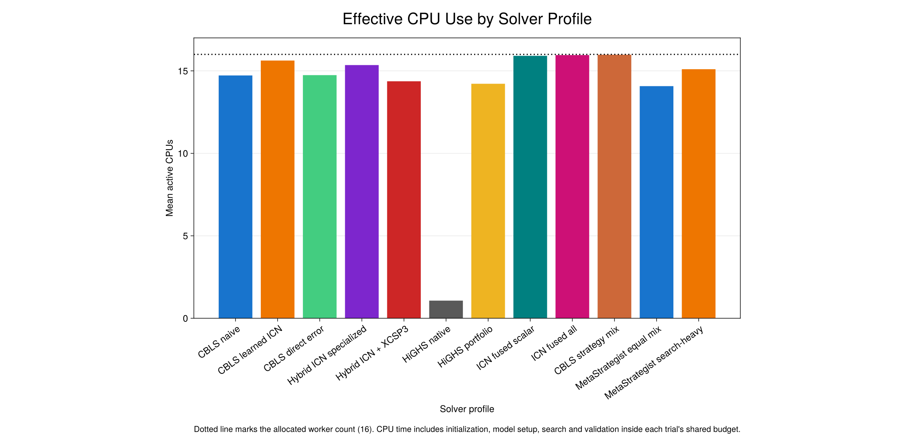

# SINTEF Li-Lim Benchmark Report

Campaign fingerprint: `d42e5d27b3c57ea0a4c360ff1a184e45def79345c4ddc91f1353e0e6b1c42131`. The frozen scope contains 3 instances, 12 solver profiles, 3 independent seeds, 16 workers and a 10.0 second wall budget per trial.

The official SINTEF archive checksums and all 3 extracted instance checksums were verified. Every stored incumbent and every trajectory point in the report was revalidated against the original Li-Lim instance. The fleet objective has priority; raw double-precision Euclidean distance is compared only after fleet count.

SINTEF publishes its distance targets to 2 decimal places. BKS attainment rounds the candidate to that displayed precision; raw double-precision distances remain in the results and determine solver rankings.

## English figures

Each plot has a precise version and an XKCDMakie version. The dotted zero line marks the published SINTEF reference where applicable; the dotted line in the CPU plot marks the allocated worker count.

### Time to the SINTEF best-known target

[Exact PNG](figures-exact/lilim-bks-attainment.png) · [Exact PDF](figures-exact/lilim-bks-attainment.pdf) · [XKCD PNG](figures-xkcd/lilim-bks-attainment-xkcd.png) · [XKCD PDF](figures-xkcd/lilim-bks-attainment-xkcd.pdf)

### Best, mean and median search quality

[Exact PNG](figures-exact/lilim-best-mean-median-vs-bks.png) · [Exact PDF](figures-exact/lilim-best-mean-median-vs-bks.pdf) · [XKCD PNG](figures-xkcd/lilim-best-mean-median-vs-bks-xkcd.png) · [XKCD PDF](figures-xkcd/lilim-best-mean-median-vs-bks-xkcd.pdf)

### Best-known solution success by instance or size

[Exact PNG](figures-exact/lilim-bks-success-by-size.png) · [Exact PDF](figures-exact/lilim-bks-success-by-size.pdf) · [XKCD PNG](figures-xkcd/lilim-bks-success-by-size-xkcd.png) · [XKCD PDF](figures-xkcd/lilim-bks-success-by-size-xkcd.pdf)

### Effective CPU use by solver profile

[Exact PNG](figures-exact/lilim-cpu-use.png) · [Exact PDF](figures-exact/lilim-cpu-use.pdf) · [XKCD PNG](figures-xkcd/lilim-cpu-use-xkcd.png) · [XKCD PDF](figures-xkcd/lilim-cpu-use-xkcd.pdf)

## Results by solver profile

| Profile | Completed / planned | Feasible / completed | BKS hits / planned | Best fleet gap per instance | Mean-run fleet gap per instance | Median-run fleet gap per instance | Median distance gap at BKS fleet | Mean time to BKS (s) | Mean active CPUs |
|---|---:|---:|---:|---:|---:|---:|---:|---:|---:|
| cbls_naive | 9 / 9 | 9 / 9 (100.0%) | 3 / 9 (33.3%) | 0.667 | 0.889 | 1.000 | 1.065% (2 cells) | 0.00 (3 hits) | 14.72 |
| cbls_icn | 9 / 9 | 9 / 9 (100.0%) | 3 / 9 (33.3%) | 0.667 | 0.889 | 1.000 | 1.065% (2 cells) | 0.00 (3 hits) | 15.63 |
| cbls_direct | 9 / 9 | 9 / 9 (100.0%) | 3 / 9 (33.3%) | 0.667 | 0.889 | 1.000 | 1.065% (2 cells) | 0.00 (3 hits) | 14.74 |
| hybrid_specialized_icn | 9 / 9 | 9 / 9 (100.0%) | 4 / 9 (44.4%) | 0.333 | 0.556 | 0.667 | 0.101% (2 cells) | 0.10 (4 hits) | 15.35 |
| hybrid_bridged_icn | 9 / 9 | 9 / 9 (100.0%) | 4 / 9 (44.4%) | 0.667 | 0.667 | 0.667 | 0.101% (2 cells) | 0.33 (4 hits) | 14.37 |
| highs_native | 9 / 9 | 9 / 9 (100.0%) | 4 / 9 (44.4%) | 1.667 | 2.111 | 2.333 | -0.000% (1 cells) | 0.96 (4 hits) | 1.07 |
| highs_portfolio | 9 / 9 | 9 / 9 (100.0%) | 6 / 9 (66.7%) | 1.667 | 1.667 | 1.667 | -0.000% (2 cells) | 3.12 (6 hits) | 14.22 |
| cbls_icn_fused_scalar | 9 / 9 | 9 / 9 (100.0%) | 3 / 9 (33.3%) | 0.667 | 0.889 | 1.000 | 1.065% (2 cells) | 0.00 (3 hits) | 15.91 |
| cbls_icn_fused_all | 9 / 9 | 9 / 9 (100.0%) | 3 / 9 (33.3%) | 0.667 | 0.889 | 1.000 | 1.065% (2 cells) | 0.00 (3 hits) | 15.96 |
| cbls_mix_strategy | 9 / 9 | 9 / 9 (100.0%) | 3 / 9 (33.3%) | 0.667 | 0.778 | 0.667 | 1.065% (2 cells) | 0.00 (3 hits) | 15.98 |
| mixed_balanced | 9 / 9 | 9 / 9 (100.0%) | 6 / 9 (66.7%) | 0.667 | 0.778 | 0.667 | -0.000% (2 cells) | 3.53 (6 hits) | 14.07 |
| mixed_ls_heavy | 9 / 9 | 9 / 9 (100.0%) | 4 / 9 (44.4%) | 0.667 | 0.778 | 0.667 | 0.101% (2 cells) | 2.17 (4 hits) | 15.10 |

## Score and solver provenance

The ICN variants below use the frozen learned-weight bank recorded in `manifest.toml`. `Fused all` is an aggregate-ICN ablation: its pairwise violation indicators are formed directly before learned aggregation, so it does not execute the individual pair decoders used by `CBLS learned ICN`. The differential tests establish score identity on their qualified synthetic domain; benchmark performance is reported separately.

| Profile | Executed score or solver path |
|---|---|
| `cbls_naive` | Handwritten constraint residuals reduced to one Boolean infeasibility indicator per candidate. |
| `cbls_icn` | Recovered learned ICN decoders are called for each scalar constraint and for each pickup-delivery route-equality and precedence constraint. |
| `cbls_direct` | Handwritten scalar residuals and direct pickup-delivery violation indicators; no ICN decoder is called. |
| `hybrid_specialized_icn` | Learned-ICN CBLS with HiGHS repair subproblems using the specialized Li-Lim formulation. |
| `hybrid_bridged_icn` | Learned-ICN CBLS with HiGHS repair subproblems using the qualified XCSP3Bridges fragment. |
| `highs_native` | HiGHS solves the full native mixed-integer model with its requested thread pool. |
| `highs_portfolio` | Independent serial HiGHS searches run as a parallel portfolio and merge their best validated incumbents. |
| `cbls_icn_fused_scalar` | Compatible scalar residuals are grouped through one learned sum-condition ICN; learned route-equality and precedence decoders still run separately for every pair. |
| `cbls_icn_fused_all` | Scalar residuals and direct pickup-delivery violation indicators are grouped through one learned sum-condition ICN; pair-specific equality and precedence ICN decoders are bypassed. |
| `cbls_mix_strategy` | A fixed portfolio of CBLS policies uses the learned-ICN scorer and merges independent validated incumbents. |
| `mixed_balanced` | MetaStrategist executes a fixed balanced allocation of CBLS, specialized hybrid, bridged hybrid and serial HiGHS workers. |
| `mixed_ls_heavy` | MetaStrategist executes a fixed search-heavy allocation of CBLS, specialized hybrid, bridged hybrid and serial HiGHS workers. |

A fleet gap of zero means the fleet matches the SINTEF reference; a negative gap is better. Best, mean-run and median-run fleet gaps are averaged per instance so large instances do not dominate. Per-instance output includes the best run, one actual median-ranked run, mean, standard deviation and full min/max spread across feasible seeds. The distance gap is shown only for instance cells whose median-ranked run uses the BKS fleet; distance remains a secondary objective. BKS time is conditional on hits, and misses are censored at the campaign budget in the attainment plot.

## Results by problem size

| Requests | Profile | BKS hits / planned | Mean best fleet gap | Mean run fleet gap | Mean median-run fleet gap | Median-run distance gap at BKS fleet |
|---:|---|---:|---:|---:|---:|---:|
| 100 | cbls_naive | 3 / 9 (33.3%) | 0.667 | 0.889 | 1.000 | 1.065% (2 cells) |
| 100 | cbls_icn | 3 / 9 (33.3%) | 0.667 | 0.889 | 1.000 | 1.065% (2 cells) |
| 100 | cbls_direct | 3 / 9 (33.3%) | 0.667 | 0.889 | 1.000 | 1.065% (2 cells) |
| 100 | hybrid_specialized_icn | 4 / 9 (44.4%) | 0.333 | 0.556 | 0.667 | 0.101% (2 cells) |
| 100 | hybrid_bridged_icn | 4 / 9 (44.4%) | 0.667 | 0.667 | 0.667 | 0.101% (2 cells) |
| 100 | highs_native | 4 / 9 (44.4%) | 1.667 | 2.111 | 2.333 | -0.000% (1 cells) |
| 100 | highs_portfolio | 6 / 9 (66.7%) | 1.667 | 1.667 | 1.667 | -0.000% (2 cells) |
| 100 | cbls_icn_fused_scalar | 3 / 9 (33.3%) | 0.667 | 0.889 | 1.000 | 1.065% (2 cells) |
| 100 | cbls_icn_fused_all | 3 / 9 (33.3%) | 0.667 | 0.889 | 1.000 | 1.065% (2 cells) |
| 100 | cbls_mix_strategy | 3 / 9 (33.3%) | 0.667 | 0.778 | 0.667 | 1.065% (2 cells) |
| 100 | mixed_balanced | 6 / 9 (66.7%) | 0.667 | 0.778 | 0.667 | -0.000% (2 cells) |
| 100 | mixed_ls_heavy | 4 / 9 (44.4%) | 0.667 | 0.778 | 0.667 | 0.101% (2 cells) |

## Reproducibility

- Julia: `1.13.1`.
- Threads: 16; GC threads: 1; affinity: `0,1,2,3,4,6,8,9,10,11,12,14,16,17,18,19`.
- Seeds: `41, 42, 43`; budget: 10.0 seconds.
- Source manifest, solver environment, cohort, official archives, per-instance checksums and BKS values are in `manifest.toml`.
- Detailed per-instance best, mean, median-ranked run, standard deviation, min/max spread, BKS success and time-to-target metrics are in `summary.toml` and `per-instance.csv`.
